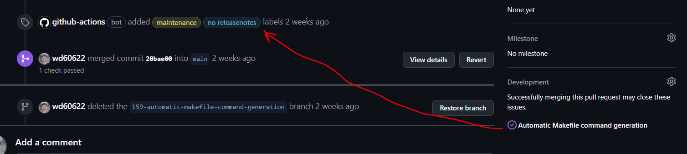

# Sync Closing Labels

GitHub action to copy labels from any issues closed by a pull request into the pull request itself.



## Quick Start

```yaml
---
name: Sync Closing Labels
on:
  pull_request_target

jobs:
  sync:
    permissions:
      pull-requests: write
    runs-on: ubuntu-latest
    steps:
      - name: Sync labels with closing issues
        uses: williambdean/closing-labels@v0.0.6
```

The action uses `github.token` by default — no additional secrets required. The workflow must grant `pull-requests: write` permission.

## Inputs

| Input | Required | Default | Description |
|---|---|---|---|
| `gh_token` | No | `${{ github.token }}` | GitHub token with `pull-requests: write` permission |
| `exclude` | No | `""` | Comma-separated list of labels to never add |
| `respect_unlabeled` | No | `"true"` | If `"true"`, labels manually removed from the PR will not be re-added |
| `owner` | No | `${{ github.repository_owner }}` | Repository owner |
| `repo` | No | `${{ github.event.repository.name }}` | Repository name |
| `pr_number` | No | `${{ github.event.number }}` | Pull request number |

## Examples

### Exclude specific labels

```yaml
- uses: williambdean/closing-labels@v0.0.6
  with:
    exclude: "wontfix,duplicate"
```

### Re-add labels even if manually removed

```yaml
- uses: williambdean/closing-labels@v0.0.6
  with:
    respect_unlabeled: "false"
```

### Use a custom token

```yaml
- uses: williambdean/closing-labels@v0.0.6
  with:
    gh_token: ${{ secrets.MY_GITHUB_TOKEN }}
```

## How It Works

1. Queries the GitHub GraphQL API to find all issues referenced as "closing" by the pull request
2. Collects all labels from those issues
3. Optionally subtracts any labels that were manually removed from the PR (`respect_unlabeled`)
4. Optionally filters out labels in the `exclude` list
5. Applies the remaining labels to the pull request via the GitHub REST API

## Security

Please see our [Security Policy](SECURITY.md) for information on how to report security vulnerabilities.

## Local Development

Build and enter the Docker container locally:

```sh
make build
make interactive
```

From inside the container, run the action with the required environment variables:

```sh
GH_TOKEN="$(gh auth token)" \
INPUT_OWNER="williambdean" \
INPUT_REPO="closing-labels" \
INPUT_PR_NUMBER="21" \
INPUT_EXCLUDE="wontfix,duplicate" \
INPUT_RESPECT_UNLABELED="true" \
INPUT_DRY_RUN="true" \
closing-labels
```

Set `INPUT_DRY_RUN="true"` to preview what labels would be applied without making any changes.
