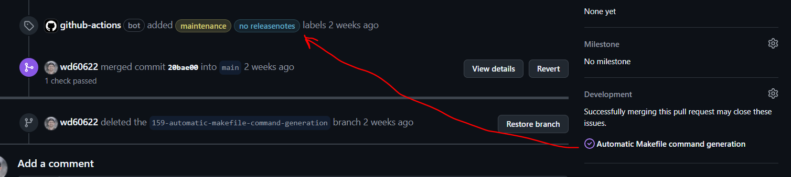

# Sync Closing Labels

GitHub action to copy labels from any issues closed by a pull request into the pull request itself.



## Quick Start

```yaml
---
name: Sync Closing Labels
on:
  pull_request_target

jobs:
  sync:
    permissions:
      pull-requests: write
    runs-on: ubuntu-latest
    steps:
      - name: Sync labels with closing issues
        uses: williambdean/closing-labels@v0.0.7
```

The action uses `github.token` by default — no additional secrets required. The workflow must grant `pull-requests: write` permission.

## Inputs

| Input | Required | Default | Description |
|---|---|---|---|
| `gh_token` | No | `${{ github.token }}` | GitHub token with `pull-requests: write` permission |
| `exclude` | No | `""` | Comma-separated list of labels to never add |
| `issue_types` | No | `"false"` | If `"true"`, also use each closing issue's type (e.g. `Bug`) as a label name |
| `respect_unlabeled` | No | `"true"` | If `"true"`, labels manually removed from the PR will not be re-added |
| `owner` | No | `${{ github.repository_owner }}` | Repository owner |
| `repo` | No | `${{ github.event.repository.name }}` | Repository name |
| `pr_number` | No | `${{ github.event.number }}` | Pull request number |
| `dry_run` | No | `"false"` | If `"true"`, print what would be added without applying it (for testing) |
| `fail_on_error` | No | `"false"` | If `"true"`, exit with an error when the sync fails; otherwise log the error and exit successfully (no-op) |

## Examples

### Exclude specific labels

```yaml
- uses: williambdean/closing-labels@v0.0.7
  with:
    exclude: "wontfix,duplicate"
```

### Include issue types as labels

```yaml
- uses: williambdean/closing-labels@v0.0.7
  with:
    issue_types: "true"
```

### Re-add labels even if manually removed

```yaml
- uses: williambdean/closing-labels@v0.0.7
  with:
    respect_unlabeled: "false"
```

### Use a custom token

```yaml
- uses: williambdean/closing-labels@v0.0.7
  with:
    gh_token: ${{ secrets.MY_GITHUB_TOKEN }}
```

## How It Works

1. Queries the GitHub GraphQL API to find all issues referenced as "closing" by the pull request
2. Collects all labels from those issues (plus each issue's type when `issue_types: "true"`)
3. Optionally subtracts any labels that were manually removed from the PR (`respect_unlabeled`)
4. Optionally filters out labels in the `exclude` list
5. Skips labels already present on the pull request
6. Applies the remaining labels to the pull request via the GitHub REST API

## Limitations

Labels are synced only from issues closed in the **same repository** as the pull request. GitHub's closing keywords (`Closes`, `Fixes`, …) are same-repo only, so cross-repository references are not treated as closing references and are ignored by this action.

By default the action is best-effort: if a GitHub API call fails, the error is logged and the action exits successfully, leaving the pull request unchanged (a no-op). Set `fail_on_error: "true"` to fail the workflow step instead. A pull request with no closing issues is also a no-op.

## Security

Please see our [Security Policy](SECURITY.md) for information on how to report security vulnerabilities.

For actions, we recommend pinning `uses:` to a **full commit SHA** rather than a mutable tag or branch, e.g.:

```yaml
- uses: williambdean/closing-labels@0123456789abcdef0123456789abcdef01234567 # v1.0.0
```

The tag in the comment is only a convenience for tracking which release the SHA corresponds to.

## Local Development

Build and enter the Docker container locally:

```sh
make build
make interactive
```

From inside the container, run the action with the required environment variables:

```sh
GH_TOKEN="$(gh auth token)" \
INPUT_OWNER="williambdean" \
INPUT_REPO="closing-labels" \
INPUT_PR_NUMBER="21" \
INPUT_EXCLUDE="wontfix,duplicate" \
INPUT_RESPECT_UNLABELED="true" \
INPUT_DRY_RUN="true" \
closing-labels
```

Set `INPUT_DRY_RUN="true"` to preview what labels would be applied without making any changes.
